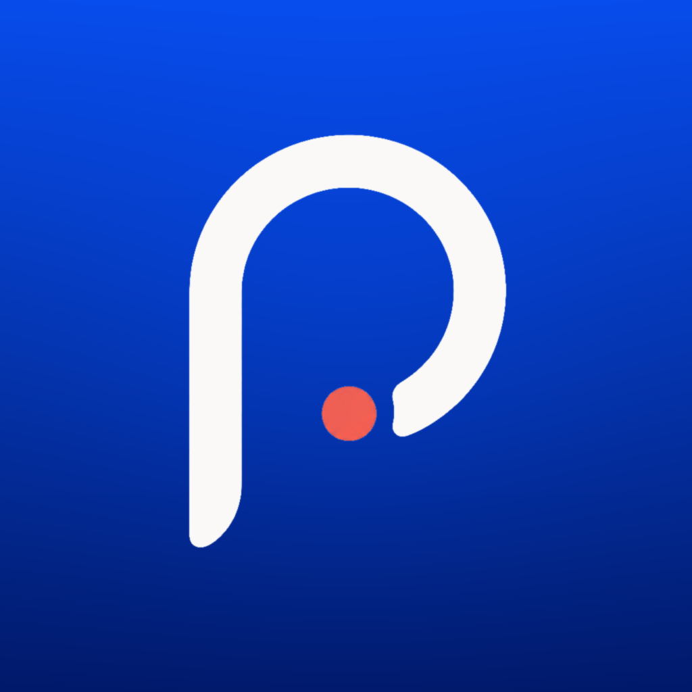
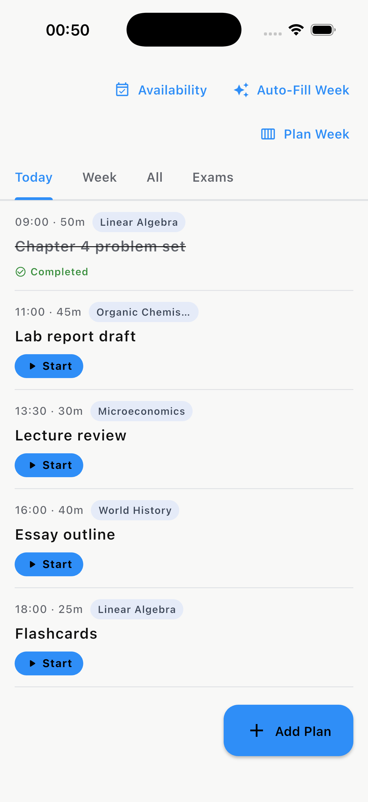
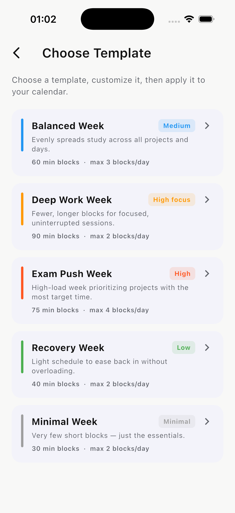
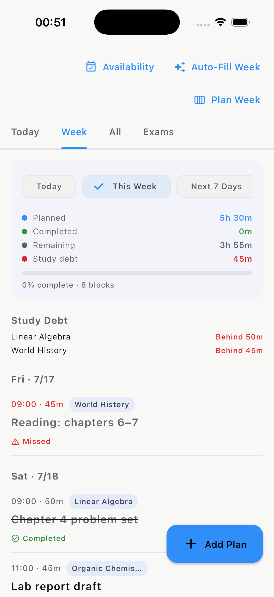

  

<h1 align="center">Pace</h1>

  A cross-platform productivity app for study tracking, planning, projects,
  tasks, and academic progress.

  
  
  
  

---

Pace helps students plan their time, track focused study sessions, and see real
progress toward academic goals. It brings sessions, tasks, weekly plans, and
grade tracking into one local-first app with optional cloud backup, so a
student's plan and their results live in the same place.

> This repository is a public showcase of the product. The full application
> source is maintained in a private repository during active development.

## Overview

Students juggle deadlines, exams, and long-term goals across scattered tools —
a timer here, a to-do list there, a spreadsheet for grades somewhere else. Pace
brings all of it together: you plan the week, run and track study sessions,
organize work by project and subject, and watch reports and GPA update as you
go. It is built for students and independent learners who want structure without
friction. The product exists because tracking effort and tracking outcomes
should not require five disconnected apps.

## Screenshots

<table>
  <tr>
    <td width="33%" align="center">
       
      <b>Daily plan</b> — the day's study blocks
    </td>
    <td width="33%" align="center">
       
      <b>Auto-Fill Week</b> — generate a week from a template
    </td>
    <td width="33%" align="center">
       
      <b>Weekly analytics</b> — planned vs. completed &amp; study debt
    </td>
  </tr>
</table>

More screens (Today, Projects, Reports, GPA) are added as the beta build stabilizes.

## Features

### Study Tracking
- Focused study sessions with multiple timer modes
- Per-session and historical session records
- Study-session analytics ("Pace Score" productivity signal)

### Planning & Tasks
- Weekly planning with an auto-plan assistant
- Task management with priorities and due dates
- Calendar tools with scheduled reminders and notifications

### Projects
- Projects and subjects with folders and ordering
- Per-project targets, deadlines, and progress

### Analytics & Reports
- Performance reports across every project and subject
- Productivity analytics derived from real session history

### Academic Tools
- GPA and academic-progress tracking
- Score trackers, grading schemes, and exam-prep planning

### Data & Accounts
- Local-first storage with Excel/data import and export
- Authentication (Google / Apple / email) and cloud-backed sync

## Tech Stack

- **Framework:** Flutter (Dart)
- **Local storage:** SQLite (`sqflite`), local-first architecture
- **Backend:** Firebase — Authentication, Cloud Firestore, Crashlytics
- **Auth:** Google Sign-In, Sign in with Apple, email/password
- **Other:** local notifications, timezone-aware scheduling, Excel import/export
- **Platforms:** iOS and Android

## Product Development

Pace is an independent product I own end to end. My work spans:

- Product concept and scope
- Feature prioritization and roadmap
- User flows and interaction design
- Testing and quality (a large automated test suite backs the app)
- Iteration and debugging based on real usage
- Release preparation (app identity, signing, store readiness)

Development is AI-assisted — I use modern AI tooling to move faster on
implementation — while the product direction, architecture decisions, feature
prioritization, and quality bar are mine.

## Current Status

Active development, preparing for private beta testing. A signed Android build
is ready; iOS is being prepared for TestFlight.

## License

This is a public showcase of a proprietary product. The application source is
not open-source and is not licensed for reuse. See the private repository for
source access.
